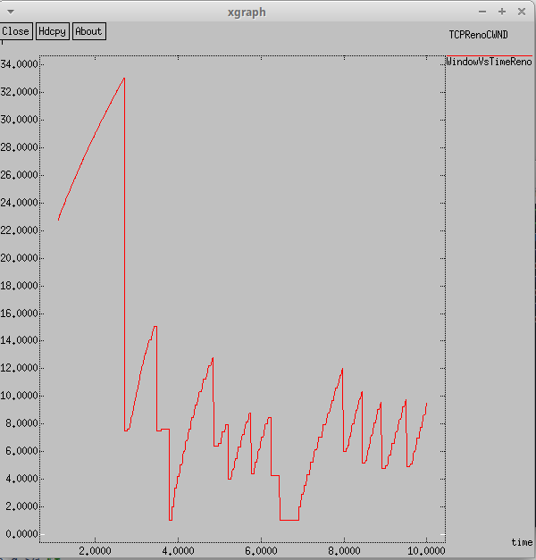
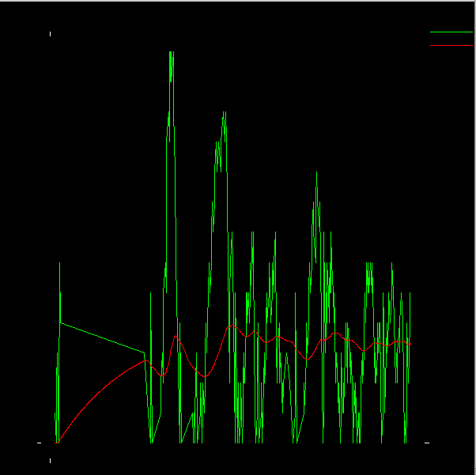

---
## Front matter
title: "Презентация по лабораторной работе № 1"
subtitle: "Простые модели компьютерной сети"
author: "Нзита Диатезилуа Катенди"

## Generic otions
lang: ru-RU

## Formatting
toc: false
slide_level: 2
theme: metropolis
header-includes:
- \metroset{progressbar=frametitle,sectionpage=progressbar,numbering=fraction}
- '\makeatletter'
- '\beamer@ignorenonframefalse'
- '\makeatother'
aspectratio: 43
section-titles: true
---

# Информация

## Докладчик

:::::::::::::: {.columns align=center}
::: {.column width="70%"}

  * Нзита Диатезилуа Катенди
  * студент группы НКНбд-01-21
  * Российский университет дружбы народов
  * <https://github.com/NzitaKatendi>

:::
::: {.column width="30%"}

:::
::::::::::::::

# Цели и задачи работы

## Цель лабораторной работы

Приобретение навыков моделирования сетей передачи данных с помощью средства имитационного моделирования NS-2, а также анализ полученных результатов моделирования.

## Задание к лабораторной работе

* 1.1. Шаблон сценария для NS-2
* 1.2. Простой пример описания топологии сети, состоящей из двух узлов и одного соединения
* 1.3. Пример с усложнённой топологией сети
* 1.4. Пример с кольцевой топологией сети

# Процесс выполнения лабораторной работы

## 1.1. Шаблон сценария для NS-2

{ #fig:002 width=70% height=70% }

{ #fig:002 width=70% height=70% }

После сохранения изменений, внесенных в файл shablon.tch, мы скомпилировали симулятор, так как мы только создали симулятор и не добавили никакой информации, то результат, который мы получили, был пустым.

{ #fig:002 width=70% height=70% }

##  1.2. Простой пример описания топологии сети, состоящей из двух узлов и одного соединения

{ #fig:002 width=70% height=70% }

{ #fig:002 width=70% height=70% }

## 1.3. Пример с усложнённой топологией сети

{ #fig:002 width=70% height=70% }

{ #fig:002 width=70% height=70% }

{ #fig:002 width=70% height=70% }

{ #fig:002 width=70% height=70% }

## 1.4. Пример с кольцевой топологией сети

{ #fig:002 width=70% height=70% }

{ #fig:002 width=70% height=70% }

{ #fig:002 width=70% height=70% }

{ #fig:002 width=70% height=70% }

# Выводы по проделанной работе

## Вывод

В процессе выполнения этой лабораторной работы я приобрел навыки моделирования сетей передачи данных с помощью инструмента разработки NS-2 simulation, который также проанализировал полевые результаты разработки.

