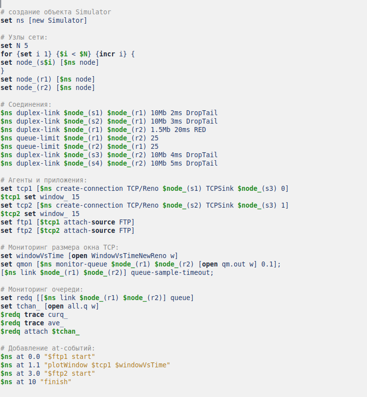
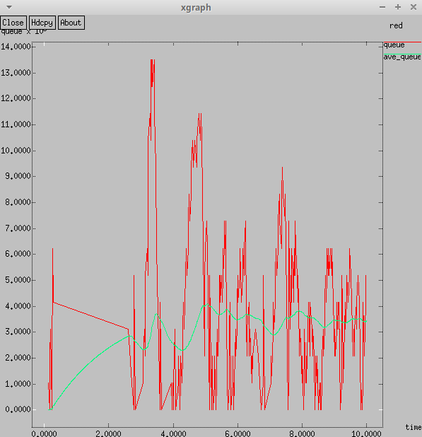
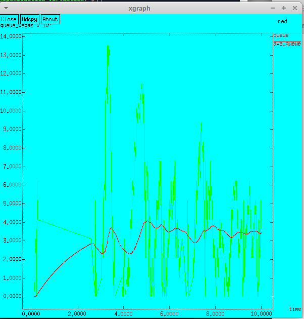

---
# Front matter
lang: ru-RU
title: "Отчет по Лабораторной Работе №2"
subtitle: "Протокол TCP и алгоритм управления очередью RED"
author: "Нзита Диатезилуа Катенди"

## Pdf output format
toc: true # Table of contents
toc-depth: 2
fontsize: 12pt
linestretch: 1.5
papersize: a4
documentclass: scrreprt
## I18n polyglossia
polyglossia-lang:
  name: russian
  options:
        - spelling=modern
        - babelshorthands=true
polyglossia-otherlangs:
  name: english
## I18n babel
babel-lang: russian
babel-otherlangs: english
## Fonts
mainfont: PT Serif
romanfont: PT Serif
sansfont: PT Sans
monofont: PT Mono
mainfontoptions: Ligatures=TeX
romanfontoptions: Ligatures=TeX
sansfontoptions: Ligatures=TeX,Scale=MatchLowercase
monofontoptions: Scale=MatchLowercase,Scale=0.9
## Biblatex
biblatex: true
biblio-style: "gost-numeric"
biblatexoptions:
  - parentracker=true
  - backend=biber
  - hyperref=auto
  - language=auto
  - autolang=other*
  - citestyle=gost-numeric
## Pandoc-crossref LaTeX customization
figureTitle: "Рис."
tableTitle: "Таблица"
listingTitle: "Листинг"
lofTitle: "Цель Работы"
lotTitle: "Ход Работы"
lolTitle: "Листинги"
## Misc options
indent: true
header-includes:
  - \usepackage{indentfirst}
  - \usepackage{float} # keep figures where there are in the text
  - \floatplacement{figure}{H} # keep figures where there are in the text
---

# Цель работы

Целью работы является изучение протокола TCP (Transmission Control Protocol) и алгоритма управления очередью RED (Random Early Detection). Оба эти элемента играют важную роль в современных компьютерных сетях.

Протокол TCP является одним из основных протоколов передачи данных в сетях TCP/IP. Его основное назначение - обеспечение надежной передачи данных путем управления потоком информации, обнаружения ошибок и повторной передачи потерянных пакетов.

# Выполнение лабораторной работы

## Задача 1

Рассмотрел пример моделирования сети со следующими характеристиками:

- сеть состоит из 6 узлов;
- между всеми узлами установлено дуплексное соединение с различными пропускной способностью и задержкой 10 мс (см. рис. 2.4);
- узел r1 использует очередь с дисциплиной RED для накопления пакетов, максимальный размер которой составляет 25;
- TCP-источники на узлах s1 и s2 подключаются к TCP-приёмнику на узле s3;
- генераторы трафика FTP прикреплены к TCP-агентам.

На базе файла shablon.tcl, создал файл lab2.tcl и отредактировал его.

{ #fig:001 width=70% }

Запустил его командой $ns$.

{ #fig:002 width=70% }

## Задача 2

Отредактировал файл lab2.tc, изменив в модели на узле s1 тип протокола TCP с Reno на NewReno:

{ #fig:003 width=70% }

Отредактировал файл lab2.tc, изменив в модели на узле s1 тип протокола TCP с Reno на NewReno:

{ #fig:004 width=70% }

Внес сдледующие изменения при отображении окон с графиками:

- Изменение цвета фона

{ #fig:005 width=70% }

- Изменение цвета траекторий

{ #fig:006 width=70% }

- Изменение подписей к осям

{ #fig:007 width=70% }

- Изменение подписи траектории в легенде

{ #fig:008 width=70% }

# Выводы

В результате проделанной лабораторной работы мы изучили протокол TCP и алгоритм управления очередью RED.
В целом, изучение протокола TCP и алгоритма управления очередью RED подчеркивает их важную роль в обеспечении надежной и эффективной передачи данных в современных компьютерных сетях, а также необходимость балансирования между надежностью, производительностью и адаптивностью с целью оптимизации работы сети.