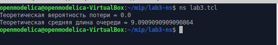
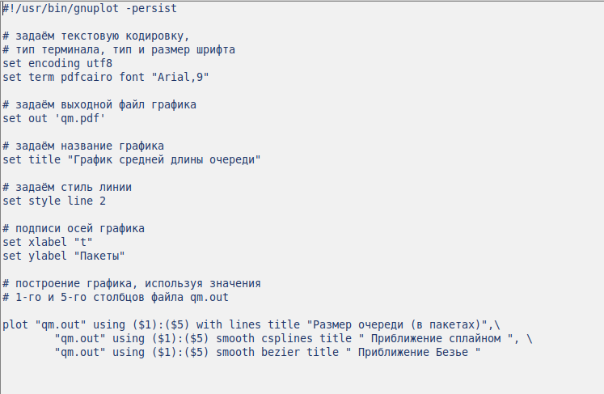
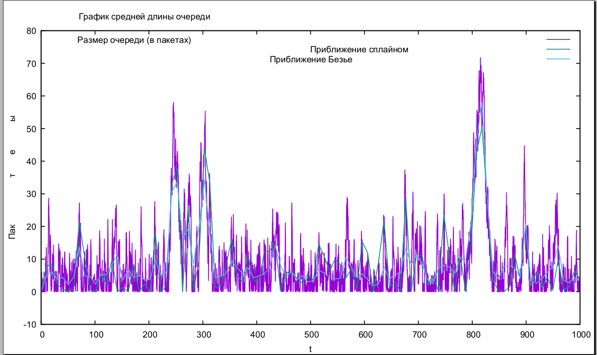

---
## Front matter
title: "Презентация по лабораторной работе № 3"
subtitle: "Моделирование стохастических процессов"
author: " Нзита Диатезилуа Катенди"

## Generic otions
lang: ru-RU

## Formatting
toc: false
slide_level: 2
theme: metropolis
header-includes:
- \metroset{progressbar=frametitle,sectionpage=progressbar,numbering=fraction}
- '\makeatletter'
- '\beamer@ignorenonframefalse'
- '\makeatother'
aspectratio: 43
section-titles: true
---

# Информация

## Докладчик

:::::::::::::: {.columns align=center}
::: {.column width="70%"}

  * Нзита Диатезилуа Катенди
  * студент группы НКНбд-01-21
  * Российский университет дружбы народов
  * <https://github.com/NzitaKatendi/Modeling-of-information-processes>

:::
::: {.column width="30%"}

:::
::::::::::::::

# Цель работы
 
 
 Моделирование стохастических процессов с использованием GNUplot для визуализации данных о средней длине очереди в сетевом узле.

# Выполнение лабораторной работы

## Задача 1

 Построение графика, отражающего изменение средней длины очереди в сетевом узле в зависимости от времени.

На базе файла shablon.tcl, создал файл lab3.tcl и отредактировал его.

{ #fig:001 width=70% }

Запустил его командой $ns$.

{ #fig:002 width=70% }

## Задача 2

В каталоге проекта я создал отдельный файлgraph_plot:

Откройте его для редактирования и добавьте следующий код:

{ #fig:003 width=70% }

Запустил его командой $ns$.

{ #fig:003 width=70% }

После компиляции файла проекта я запустил сценарий для сгенерированного файла Graph_plot, который создал файл qm.pdf с результатами моделирования.

{ #fig:004 width=70% }

{ #fig:005 width=70% }

# Выводы

 Используя инструмент GNUplot, мы успешно построили график, отображающий изменение средней длины очереди в сетевом узле. Полученные данные позволяют наглядно оценить динамику загрузки узла и потенциальные проблемы с производительностью сети.