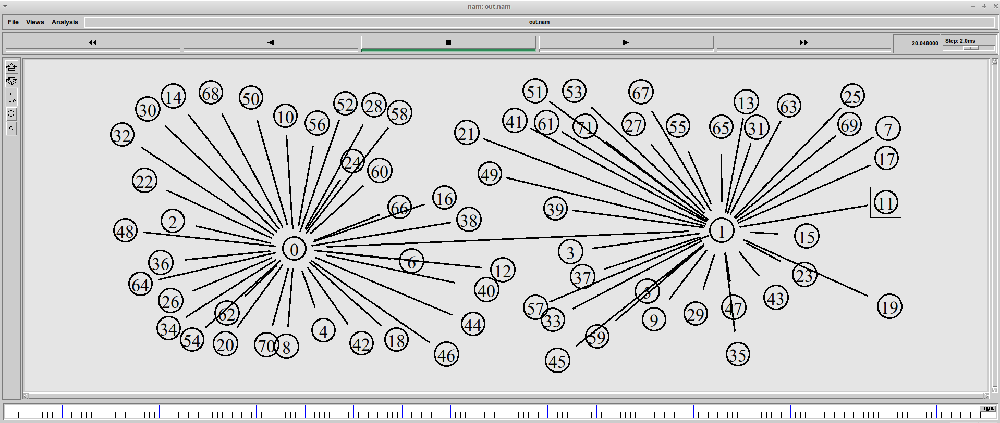
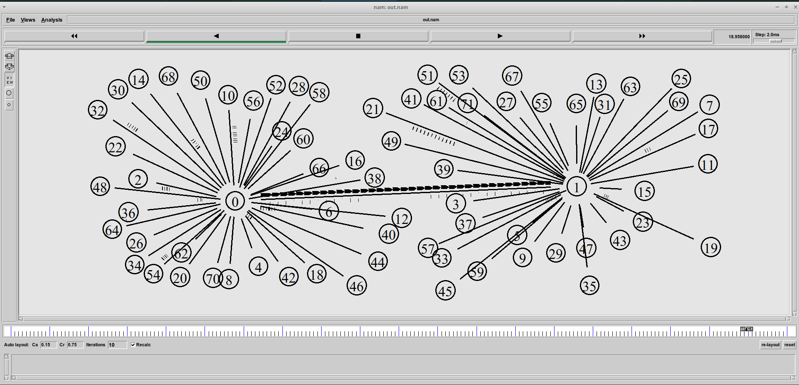
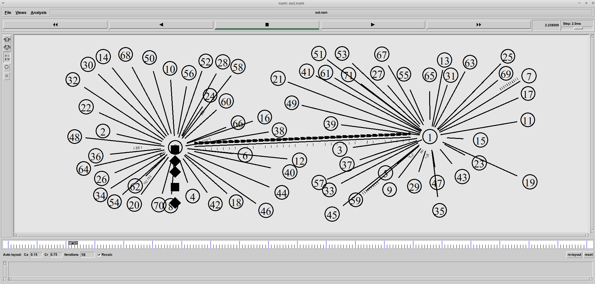
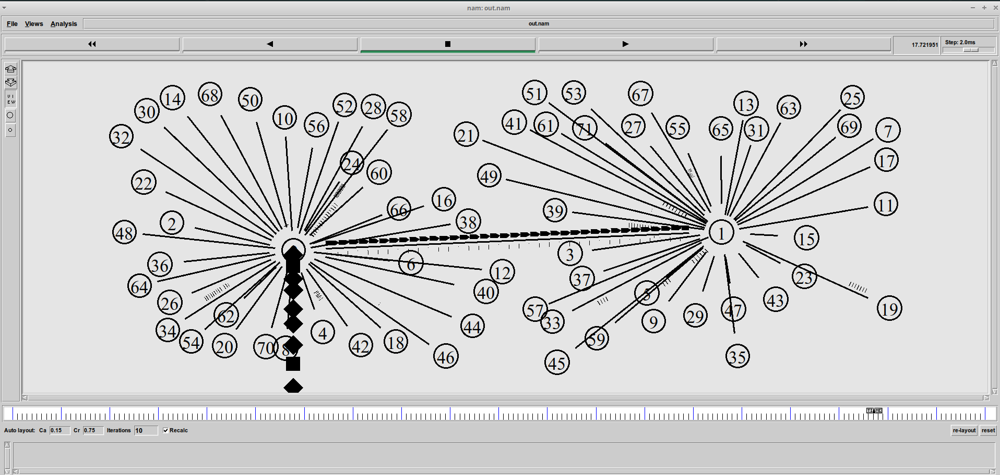
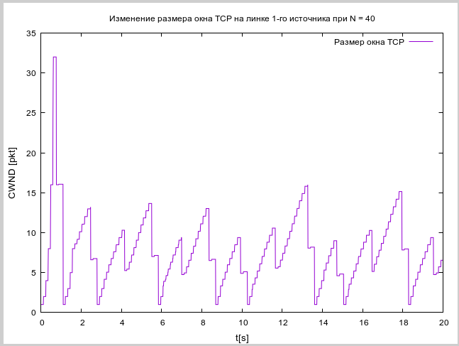
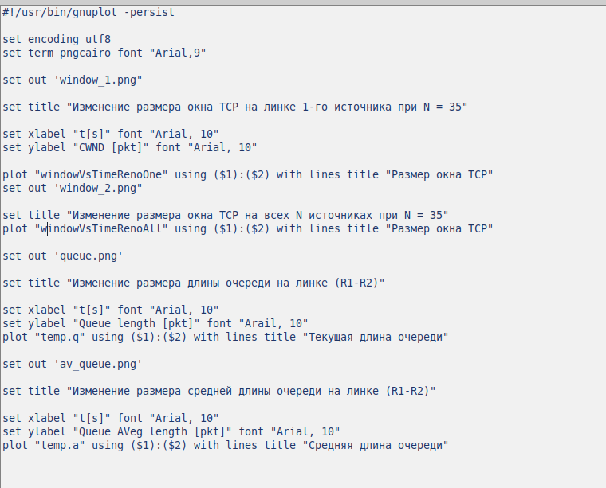
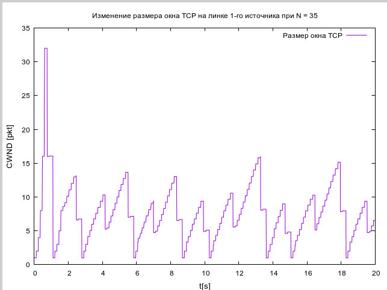
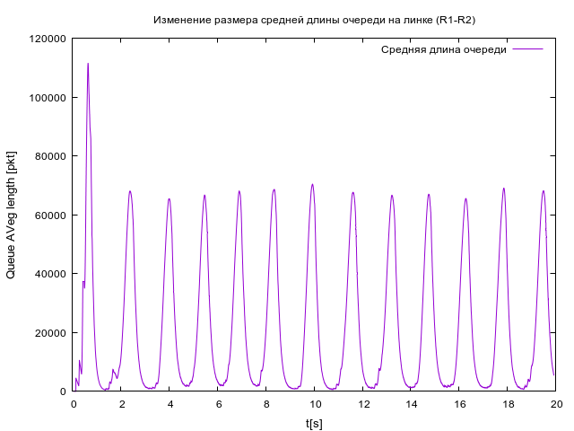
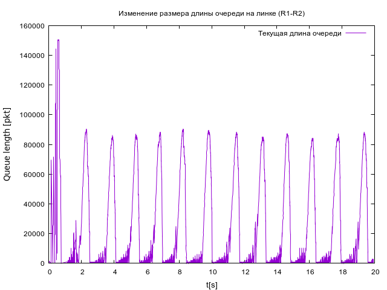

---
## Front matter
title: "Презентация по лабораторной работе № 4"
subtitle: " Задание для самостоятельного выполнения"
author: " Нзита Диатезилуа Катенди"

## Generic otions
lang: ru-RU

## Formatting
toc: false
slide_level: 2
theme: metropolis
header-includes:
- \metroset{progressbar=frametitle,sectionpage=progressbar,numbering=fraction}
- '\makeatletter'
- '\beamer@ignorenonframefalse'
- '\makeatother'
aspectratio: 43
section-titles: true
---

# Информация

## Докладчик

:::::::::::::: {.columns align=center}
::: {.column width="70%"}

  * Нзита Диатезилуа Катенди
  * студент группы НКНбд-01-21
  * Российский университет дружбы народов
  * <https://github.com/NzitaKatendi/Modeling-of-information-processes>

:::
::: {.column width="30%"}

:::
::::::::::::::

# Цели и задачи работы

## Цель лабораторной работы

 Цель работы заключается в разработке имитационной модели сети с использованием пакета NS-2, 
 а также анализе её характеристик с помощью графиков изменения размера окна TCP, длины очереди
  и средней длины очереди на первом маршрутизаторе. Такой анализ поможет понять, как параметры 
  сети влияют на производительность передачи данных.

Чтобы выполнить эту задачу, вам потребуется создать сценарий NS-2, который описывает сетевую топологию и параметры
 передачи данных, а затем запустить моделирование, чтобы собрать данные для построения графиков.
  После этого вы сможете построить графики, используя инструменты Xgraph и GNUPlot, и проанализировать полученные результаты.

# Выполнение лабораторной работы

## Задача 1

Рассмотрел пример моделирования сети со следующими характеристиками:

- Сеть состоит из N TCP-источников, N TCP-приёмников и двух маршрутизаторов R1 и R2 между источниками и приёмниками (N — не менее 20);
- Между TCP-источниками и первым маршрутизатором установлены дуплексные соединения с пропускной способностью 100 Мбит/с и задержкой 20 мс с очередью типа DropTail;
- Между TCP-приёмниками и вторым маршрутизатором установлены дуплексные соединения с пропускной способностью 100 Мбит/с и задержкой 20 мс с очередью типа DropTail;
- Между маршрутизаторами установлено симплексное соединение (R1–R2) с пропускной способностью 20 Мбит/с и задержкой 15 мс с очередью типа RED, размером буфера 300 пакетов; в обратную сторону — симплексное соединение (R2–R1) с пропускной способностью 15 Мбит/с и задержкой 20 мс с очередью типа DropTail;
- Данные передаются по протоколу FTP поверх TCPReno;
- Параметры алгоритма RED: qmin = 75, qmax = 150, qw = 0,002, pmax = 0.1;
- Максимальный размер TCP-окна 32; размер передаваемого пакета 500 байт; время моделирования — не менее 20 единиц модельного времени.

{ #fig:006 width=70% }
##

{ #fig:002 width=70% }

{ #fig:003 width=70% }

{ #fig:004 width=70% }

{ #fig:005 width=70% }

{ #fig:006 width=70% }

## Задача 2

1. Для приведённой схемы разработать имитационную модель в пакете NS-2.
2. Построить график изменения размера окна TCP (в Xgraph и в GNUPlot);
3. Построить график изменения длины очереди и средней длины очереди на первом
маршрутизаторе.

Я создал новый файлgraph_plot_lab4 и написал следующий код

{ #fig:007 width=70% }

{ #fig:008 width=70% }

{ #fig:009 width=70% }

{ #fig:010 width=70% }

{ #fig:011 width=70% }

##

# Выводы

Результаты моделирования позволяют понять влияние сетевых параметров на производительность данных и эффективность управления трафиком, а также создать графики для изменения размера окна TCP, изменения длины очереди и средней длины очереди.