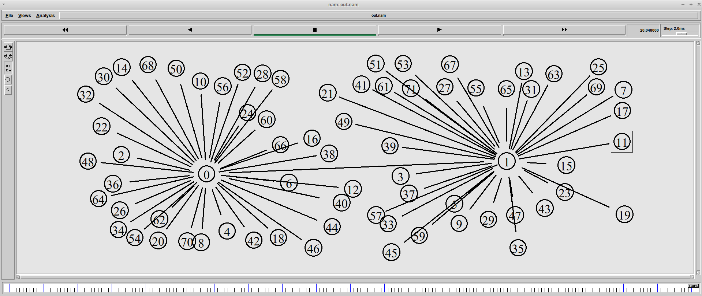
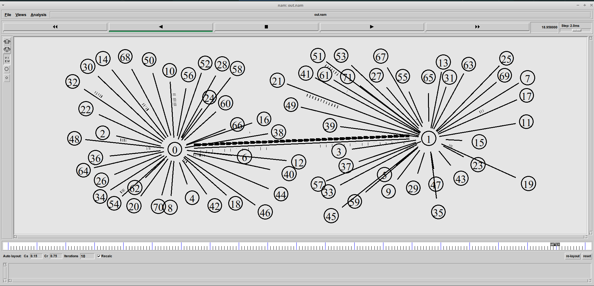
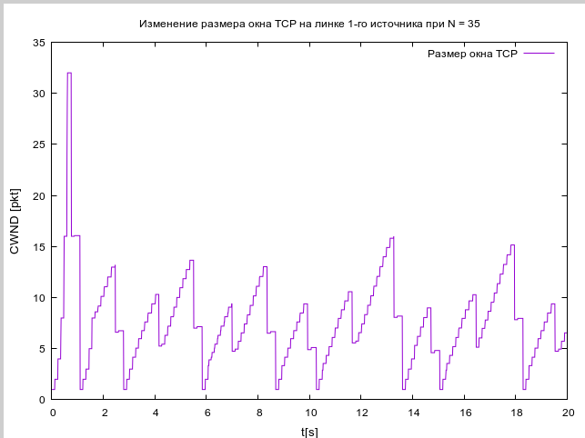

---
# Front matter
lang: ru-RU
title: "Отчет по Лабораторной Работе № 4"
subtitle: "Задание для самостоятельного выполнения"
author: "Нзита Диатезилуа Катенди"

## Pdf output format
toc: true # Table of contents
toc-depth: 2
fontsize: 12pt
linestretch: 1.5
papersize: a4
documentclass: scrreprt
## I18n polyglossia
polyglossia-lang:
  name: russian
  options:
        - spelling=modern
        - babelshorthands=true
polyglossia-otherlangs:
  name: english
## I18n babel
babel-lang: russian
babel-otherlangs: english
## Fonts
mainfont: PT Serif
romanfont: PT Serif
sansfont: PT Sans
monofont: PT Mono
mainfontoptions: Ligatures=TeX
romanfontoptions: Ligatures=TeX
sansfontoptions: Ligatures=TeX,Scale=MatchLowercase
monofontoptions: Scale=MatchLowercase,Scale=0.9
## Biblatex
biblatex: true
biblio-style: "gost-numeric"
biblatexoptions:
  - parentracker=true
  - backend=biber
  - hyperref=auto
  - language=auto
  - autolang=other*
  - citestyle=gost-numeric
## Pandoc-crossref LaTeX customization
figureTitle: "Рис."
tableTitle: "Таблица"
listingTitle: "Листинг"
lofTitle: "Цель Работы"
lotTitle: "Ход Работы"
lolTitle: "Листинги"
## Misc options
indent: true
header-includes:
  - \usepackage{indentfirst}
  - \usepackage{float} # keep figures where there are in the text
  - \floatplacement{figure}{H} # keep figures where there are in the text
---

# Цели и задачи работы

## Цель лабораторной работы

 Цель работы заключается в разработке имитационной модели сети с использованием пакета NS-2, 
 а также анализе её характеристик с помощью графиков изменения размера окна TCP, длины очереди
  и средней длины очереди на первом маршрутизаторе. Такой анализ поможет понять, как параметры 
  сети влияют на производительность передачи данных.

Чтобы выполнить эту задачу, вам потребуется создать сценарий NS-2, который описывает сетевую топологию и параметры
 передачи данных, а затем запустить моделирование, чтобы собрать данные для построения графиков.
  После этого вы сможете построить графики, используя инструменты Xgraph и GNUPlot, и проанализировать полученные результаты.

# Выполнение лабораторной работы

## Задача 1

Рассмотрел пример моделирования сети со следующими характеристиками:

- Сеть состоит из N TCP-источников, N TCP-приёмников и двух маршрутизаторов R1 и R2 между источниками и приёмниками (N — не менее 20);
- Между TCP-источниками и первым маршрутизатором установлены дуплексные соединения с пропускной способностью 100 Мбит/с и задержкой 20 мс с очередью типа DropTail;
- Между TCP-приёмниками и вторым маршрутизатором установлены дуплексные соединения с пропускной способностью 100 Мбит/с и задержкой 20 мс с очередью типа DropTail;
- Между маршрутизаторами установлено симплексное соединение (R1–R2) с пропускной способностью 20 Мбит/с и задержкой 15 мс с очередью типа RED, размером буфера 300 пакетов; в обратную сторону — симплексное соединение (R2–R1) с пропускной способностью 15 Мбит/с и задержкой 20 мс с очередью типа DropTail;
- Данные передаются по протоколу FTP поверх TCPReno;
- Параметры алгоритма RED: qmin = 75, qmax = 150, qw = 0,002, pmax = 0.1;
- Максимальный размер TCP-окна 32; размер передаваемого пакета 500 байт; время моделирования — не менее 20 единиц модельного времени.

##

TCP (Transmission Control Protocol) - это одsetин из основных протоколов интернет-связи. Он отвечает за надежную доставку данных между двумя устройствами в сети. TCP работает в модели транспортного уровня стека протоколов TCP/IP.

# Создание обьекта SImulator
set ns [new Simulator]

#  открытие на запись файла out.nam для визуализатора nam

set nf [open out.nam w]

# все результаты моделирования будут записаны в переменную nf

$ns namtrace-all $nf

# открытие на запись файла трассировки out.tr
# для регистрации всех событий

set f [open out.tr w]

# все регистрируемые события будут записаны в переменную 

$ns trace-all $f

Agent/TCP set window_ 32
Agent/TCP set pktSize_ 500

# процедура finish закрывает файлы трассировки
# и запускает визуализатор nam

proc finish {} {
	global tchan_
#Подклучение кода аwk
	set awkCode {
	{
		if ($1 == "Q" && NF>2) {
			print $2, $3 >> "temp.q";
			set end $2
	}
		else if ($1 == "a" && NF>2)
			print $2, $3 >> "temp.a";
	}
}

exec rm -f temp.q temp.a
exec touch temp.a temp.q

set f [open temp.q w]
puts $f "0.Color: Purple"
close $f

set f [open temp.a w]
puts $f "O.color Purple"

exec awk $awkCode all.q

# Запуск xgraph с графиками окна TCP и очереди:

exec xgraph -fg pink -bg purple -bb -tk -x time -t "TCPRenoCWND" WindowVsTimeRenoOne &
exec xgraph -fg pink -bg purple -bb -tk -x time -t "TCPRenoCWND" WindowVsTimeRenoAll &
exec xgraph -bb -tk -x time -y queue temp.q &
exec xgraph -bb -tk -x time -y queue temp.a &
exec nam out.nam &
exit 0
}

# Формирование файла с данными о размере окна TCP:
proc plotWindow {tcpSource file} {
	global ns
	set time 0.01
	set now [$ns now]
	set cwnd [$tcpSource set cwnd_]
	puts $file "$now $cwnd"
	$ns at [expr $now+$time] "plotWindow $tcpSource $file"
}

set r1 [$ns node]
set r2 [$ns node]

# Соединения:

$ns simplex-link $r1 $r2 20Mb 15ms RED
$ns simplex-link $r2 $r1 15Mb 20ms DropTail
$ns queue-limit $r1 $r2 300

 # Узлы сети:

set N 40

for {set i 0} {$i < $N} {incr i} {
	set n1($i) [$ns node]
	$ns duplex-link $n1($i) $r1 100Mb 20ms DropTail
	set n2($i) [$ns node]
	$ns duplex-link $n2($i) $r2 100Mb 20ms DropTail
	
	set tcp($i) [$ns create-connection TCP/Reno $n1($i) TCPSink $n2($i) $i]
	set ftp($i) [$tcp($i) attach-source FTP]
}

# Мониторинг размера окна TCP:
set windowVsTimeOne [open windowVsTimeRenoOne  w]
puts $windowVsTimeOne "O.Color: white"
set windowVsTimeAll [open windowVsTimeRenoAll  w]
puts $windowVsTimeAll "O.Color: white"

set qmon [$ns monitor-queue $r1 $r2 [open qm.out w] 0.1];
[$ns link $r1 $r2] queue-sample-timeout;

# Мониторинг очереди:

set redq [[$ns link $r1 $r2] queue]
$redq set thresh_ 75
$redq set maxthresh_ 150
$redq set q_weight_ 0.002
$redq set linterm_ 10

set tchan_ [open all.q w]
$redq trace curq_
$redq trace ave_
$redq attach $tchan_

# Добавление at-событий:

for {set i 0} {$i < $N} {incr i} {
	$ns at 0.0 "$ftp($i) start"
	$ns at 0.0 "plotWindow $tcp($i) $windowVsTimeAll"
}

$ns at 0.0 "plotWindow $tcp(1) $windowVsTimeOne"

# at-событие для планировщика событий, которое запускает
# процедуру finish at через 20 с после начала моделирования

$ns at 20.0 "finish"

# запуск модели

$ns run

{ #fig:001 width=70% }

{ #fig:002 width=70% }

{ #fig:003 width=70% }

{ #fig:004 width=70% }

{ #fig:005 width=70% }

## Задача 2

1. Для приведённой схемы разработать имитационную модель в пакете NS-2.
2. Построить график изменения размера окна TCP (в Xgraph и в GNUPlot);
3. Построить график изменения длины очереди и средней длины очереди на первом
маршрутизаторе.

Я создал новый файлgraph_plot_lab4 и написал следующий код

#!/usr/bin/gnuplot -persist

set encoding utf8
set term pngcairo font "Arial,9"

set out 'window_1.png"

set title "Изменение размера окна ТСР на линке 1-го источника при N = 40"

set xlabel "t[s]" font "Arial, 10"
set ylabel "CWND [pkt]" font "Arial, 10"

plot "windowVsTimeRenoOne" using ($1):($2) with lines title "Размер окна ТСР"
set out 'window_2.png"

set title "Изменение размера окна ТСР на всех N источникаx при N = 40"
plot "windowVsTimeRenoAll" using ($1):($2) with lines title "Размер окна ТСР"

set out 'queue.png'

set title "Изменение размера длины очереди на линке (R1-R2)"

set xlabel "t[s]" font "Arial, 10"
set ylabel "Queue length [pkt]" font "Arail, 10"
plot "temp.q" using ($1):($2) with lines title "Текущая длина очереди"

set out 'av_queue.png'

set title "Изменение размера средней длины очереди на линке (R1-R2)"

set xlabel "t[s]" font "Arial, 10"
set ylabel "Queue AVeg length [pkt]" font "Arial, 10"
plot "temp.a" using ($1):($2) with lines title "Средняя длина очереди"

{ #fig:006 width=70% }

{ #fig:007 width=70% }

{ #fig:008 width=70% }

{ #fig:009 width=70% }

##

# Выводы

Выводы моделирования позволяют понять влияние параметров сети на производительность передачи дРезультаты моделирования позволяют понять влияние сетевых параметров на производительность данных и эффективность управления трафиком, а также создать графики для изменения размера окна TCP, изменения длины очереди и средней длины очереди.