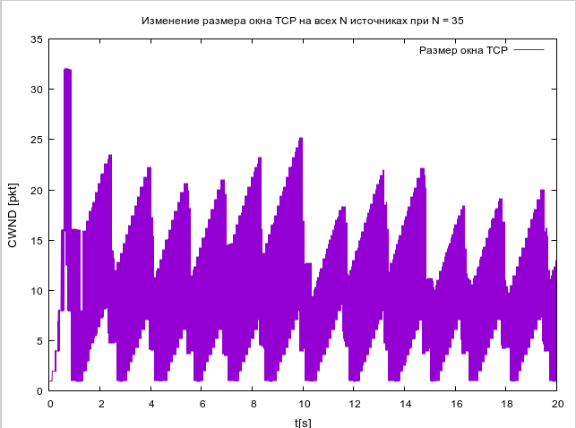

---
# Front matter
lang: ru-RU
title: "Отчет по Лабораторной Работе № 4"
subtitle: "Задание для самостоятельного выполнения"
author: "Нзита Диатезилуа Катенди"

## Pdf output format
toc: true # Table of contents
toc-depth: 2
fontsize: 12pt
linestretch: 1.5
papersize: a4
documentclass: scrreprt
## I18n polyglossia
polyglossia-lang:
  name: russian
  options:
        - spelling=modern
        - babelshorthands=true
polyglossia-otherlangs:
  name: english
## I18n babel
babel-lang: russian
babel-otherlangs: english
## Fonts
mainfont: PT Serif
romanfont: PT Serif
sansfont: PT Sans
monofont: PT Mono
mainfontoptions: Ligatures=TeX
romanfontoptions: Ligatures=TeX
sansfontoptions: Ligatures=TeX,Scale=MatchLowercase
monofontoptions: Scale=MatchLowercase,Scale=0.9
## Biblatex
biblatex: true
biblio-style: "gost-numeric"
biblatexoptions:
  - parentracker=true
  - backend=biber
  - hyperref=auto
  - language=auto
  - autolang=other*
  - citestyle=gost-numeric
## Pandoc-crossref LaTeX customization
figureTitle: "Рис."
tableTitle: "Таблица"
listingTitle: "Листинг"
lofTitle: "Цель Работы"
lotTitle: "Ход Работы"
lolTitle: "Листинги"
## Misc options
indent: true
header-includes:
  - \usepackage{indentfirst}
  - \usepackage{float} # keep figures where there are in the text
  - \floatplacement{figure}{H} # keep figures where there are in the text
---

# Цели и задачи работы

## Цель лабораторной работы

 Цель работы заключается в разработке имитационной модели сети с использованием пакета NS-2, 
 а также анализе её характеристик с помощью графиков изменения размера окна TCP, длины очереди
  и средней длины очереди на первом маршрутизаторе. Такой анализ поможет понять, как параметры 
  сети влияют на производительность передачи данных.

---
# Выполнение лабораторной работы

## Задача 1

Рассмотрел пример моделирования сети со следующими характеристиками:

- Сеть состоит из N TCP-источников, N TCP-приёмников и двух маршрутизаторов R1 и R2 между источниками и приёмниками (N — не менее 20);
- Между TCP-источниками и первым маршрутизатором установлены дуплексные соединения с пропускной способностью 100 Мбит/с и задержкой 20 мс с очередью типа DropTail;
- Между TCP-приёмниками и вторым маршрутизатором установлены дуплексные соединения с пропускной способностью 100 Мбит/с и задержкой 20 мс с очередью типа DropTail;
- Между маршрутизаторами установлено симплексное соединение (R1–R2) с пропускной способностью 20 Мбит/с и задержкой 15 мс с очередью типа RED, размером буфера 300 пакетов; в обратную сторону — симплексное соединение (R2–R1) с пропускной способностью 15 Мбит/с и задержкой 20 мс с очередью типа DropTail;
- Данные передаются по протоколу FTP поверх TCPReno;
- Параметры алгоритма RED: qmin = 75, qmax = 150, qw = 0,002, pmax = 0.1;
- Максимальный размер TCP-окна 32; размер передаваемого пакета 500 байт; время моделирования — не менее 20 единиц модельного времени.

---

{ #fig:006 width=70% }
##
---
{ #fig:002 width=70% }

---

{ #fig:003 width=70% }

---

{ #fig:004 width=70% }

---

{ #fig:005 width=70% }

---

{ #fig:006 width=70% }

---

## Задача 2

1. Для приведённой схемы разработать имитационную модель в пакете NS-2.
2. Построить график изменения размера окна TCP (в Xgraph и в GNUPlot);
3. Построить график изменения длины очереди и средней длины очереди на первом
маршрутизаторе.

Я создал новый файлgraph_plot_lab4 и написал следующий код

{ #fig:007 width=70% }

---
{ #fig:008 width=70% }

---

{ #fig:009 width=70% }

---

{ #fig:010 width=70% }

---

{ #fig:011 width=70% }

---

##

# Выводы

Результаты моделирования позволяют понять влияние сетевых параметров на производительность данных и эффективность управления трафиком, а также создать графики для изменения размера окна TCP, изменения длины очереди и средней длины очереди.