---
## Front matter
title: "Презентация по лабораторной работе № 5_1"
subtitle: "Компонентное моделирование. Scilab, подсистема xcos"
author: " Нзита Диатезилуа Катенди"

## Generic otions
lang: ru-RU

## Formatting
toc: false
slide_level: 2
theme: metropolis
header-includes:
- \metroset{progressbar=frametitle,sectionpage=progressbar,numbering=fraction}
- '\makeatletter'
- '\beamer@ignorenonframefalse'
- '\makeatother'
aspectratio: 43
section-titles: true
---

# Информация

## Докладчик

:::::::::::::: {.columns align=center}
::: {.column width="70%"}

  * Нзита Диатезилуа Катенди
  * студент группы НКНбд-01-21
  * Российский университет дружбы народов
  * <https://github.com/NzitaKatendi/Modeling-of-information-processes>

:::
::: {.column width="30%"}

:::
::::::::::::::

# Цели и задачи работы

## Цель лабораторной работы

Построить с помощью x cos фигуры Лиссажу с различными значениями параметров.
 
---

# Выполнение лабораторной работы

Строим с помощью xcos формы Лиссажу со следующими параметрами:

1) A = B = 1, a = 2, b = 2, δ = 0; π/4; π/2; 3π/4; π;

## Задача 1

На рис.1 в качестве примера приведена модель функционирования двух
источников синусоидального сигнала, позволяющая в зависимости от задаваемых
параметров построить различные фигуры Лиссажу.

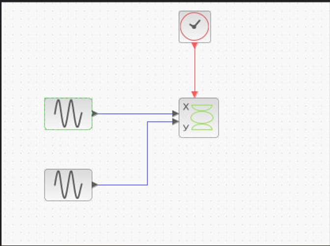{ #fig:001 width=70% }

---

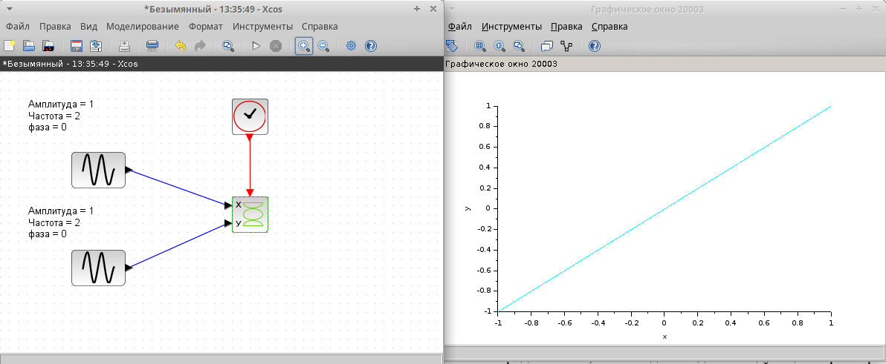{ #fig:002 width=70% }

---

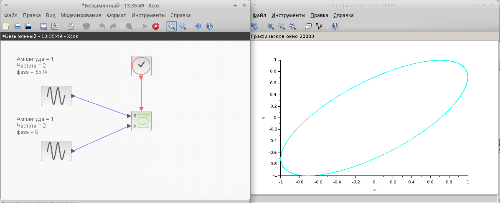{ #fig:003 width=70% }

---

{ #fig:004 width=70% }

---

{ #fig:005 width=70% }

---
Постройте с помощью xcos фигуры Лиссажу со следующими параметрами:

2) A = B = 1, a = 2, b = 4, δ = 0; π/4; π/2; 3π/4; π;

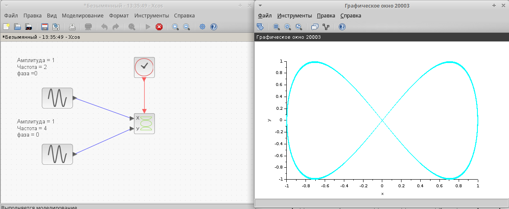{ #fig:006 width=70% }

---

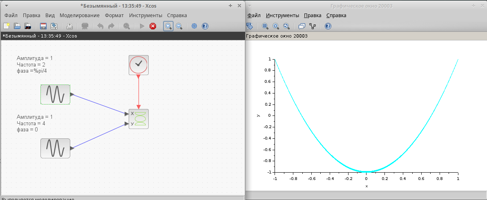{ #fig:007 width=70% }

---

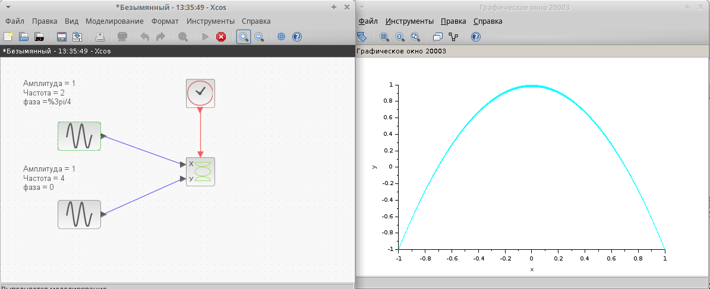{ #fig:008 width=70% }

---

{ #fig:009 width=70% }

---
Постройте с помощью xcos фигуры Лиссажу со следующими параметрами:

3) A = B = 1, a = 2, b = 6, δ = 0; π/4; π/2; 3π/4; π;

{ #fig:010 width=70% }

---

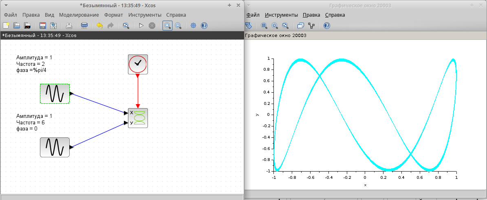{ #fig:011 width=70% }

---

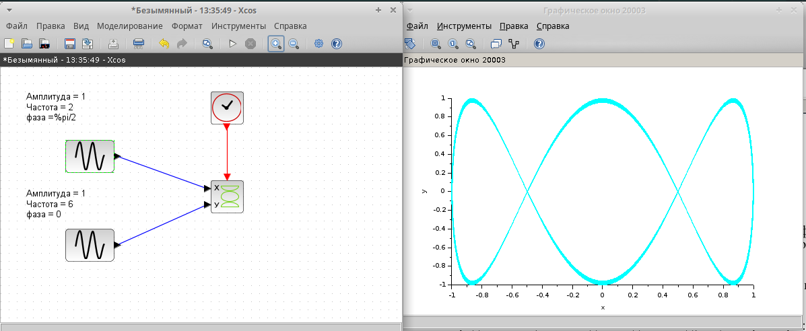{ #fig:012 width=70% }

---
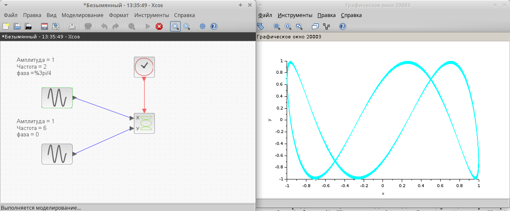{ #fig:013 width=70% }

---
## Задача 2

Modelica – свободно распространяемый объектно-ориентированный язык для моделирования сложных физических систем. В основе языка Modelica лежит концепция соединяемых блоков. При соединении в соответствии с требуемой схемой
автоматически генерируются соответствующие уравнения.

Язык Modelica в чем-то похож на императивные объектно-ориентированные языки.
В нём есть выражения, классы, наследование, функции. В основу языка положена
конструкция «уравнение» (equation).

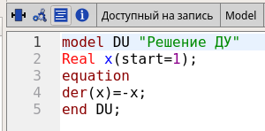{ #fig:014 width=70% }

---

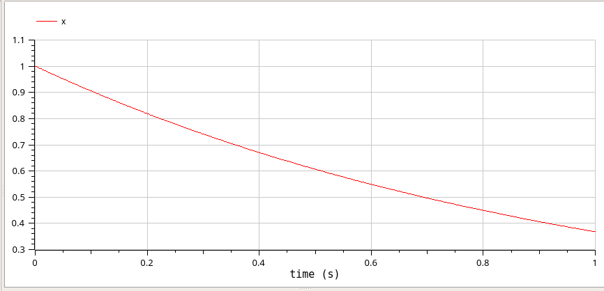{ #fig:015 width=70% }

---

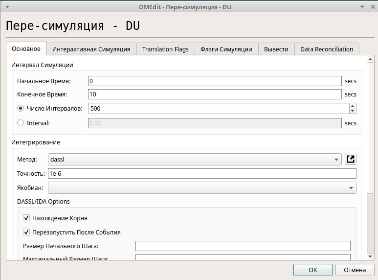{ #fig:016 width=70% }

---

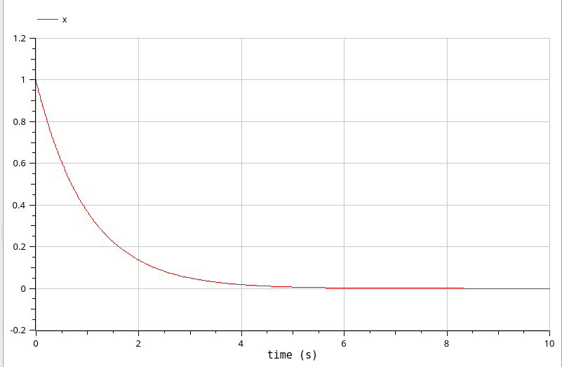{ #fig:017 width=70% }

---

# Выводы

По мере выполнения данной работы я построил фигуры Лиссажу на xcos.