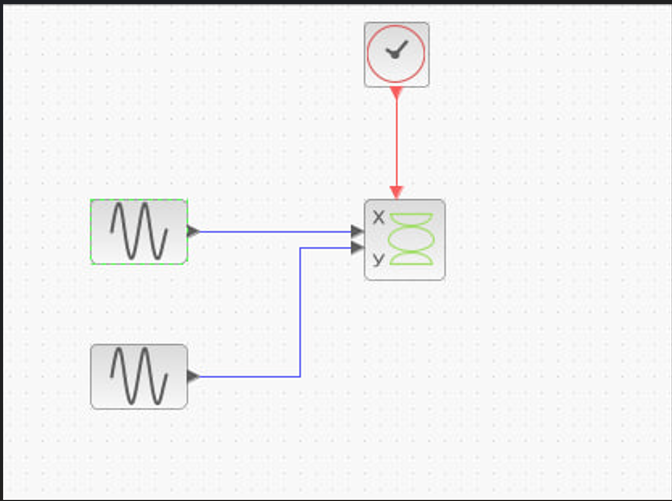
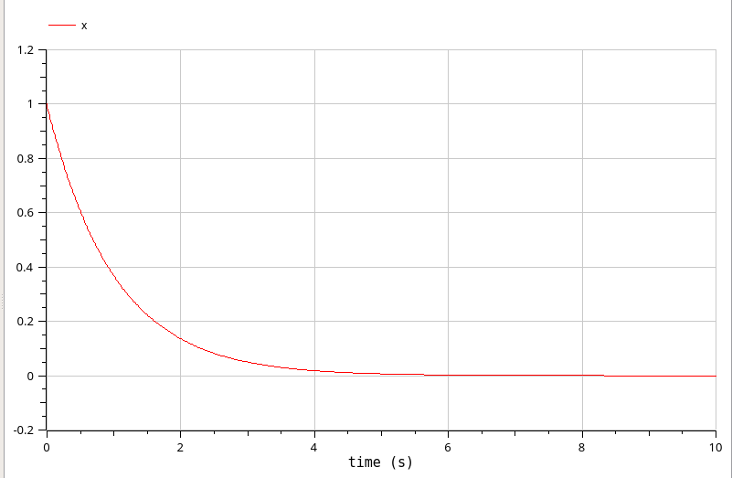

---
# Front matter
lang: ru-RU
title: "Отчет по Лабораторной Работе № 5_1"
subtitle: "Компонентное моделирование. Scilab, подсистема xcos"
author: "Нзита Диатезилуа Катенди"

## Pdf output format
toc: true # Table of contents
toc-depth: 2
fontsize: 12pt
linestretch: 1.5
papersize: a4
documentclass: scrreprt
## I18n polyglossia
polyglossia-lang:
  name: russian
  options:
        - spelling=modern
        - babelshorthands=true
polyglossia-otherlangs:
  name: english
## I18n babel
babel-lang: russian
babel-otherlangs: english
## Fonts
mainfont: PT Serif
romanfont: PT Serif
sansfont: PT Sans
monofont: PT Mono
mainfontoptions: Ligatures=TeX
romanfontoptions: Ligatures=TeX
sansfontoptions: Ligatures=TeX,Scale=MatchLowercase
monofontoptions: Scale=MatchLowercase,Scale=0.9
## Biblatex
biblatex: true
biblio-style: "gost-numeric"
biblatexoptions:
  - parentracker=true
  - backend=biber
  - hyperref=auto
  - language=auto
  - autolang=other*
  - citestyle=gost-numeric
## Pandoc-crossref LaTeX customization
figureTitle: "Рис."
tableTitle: "Таблица"
listingTitle: "Листинг"
lofTitle: "Цель Работы"
lotTitle: "Ход Работы"
lolTitle: "Листинги"
## Misc options
indent: true
header-includes:
  - \usepackage{indentfirst}
  - \usepackage{float} # keep figures where there are in the text
  - \floatplacement{figure}{H} # keep figures where there are in the text
---
# Цели и задачи работы

## Цель лабораторной работы

Построить с помощью x cos фигуры Лиссажу с различными значениями параметров.
 
---

# Выполнение лабораторной работы

Строим с помощью xcos формы Лиссажу со следующими параметрами:

1) A = B = 1, a = 2, b = 2, δ = 0; π/4; π/2; 3π/4; π;

## Задача 1

{ #fig:001 width=70% }

---

{ #fig:002 width=70% }

---

{ #fig:003 width=70% }

---

{ #fig:004 width=70% }

---

{ #fig:005 width=70% }

---
Постройте с помощью xcos фигуры Лиссажу со следующими параметрами:

2) A = B = 1, a = 2, b = 4, δ = 0; π/4; π/2; 3π/4; π;

{ #fig:006 width=70% }

---

{ #fig:007 width=70% }

---

{ #fig:008 width=70% }

---

{ #fig:009 width=70% }

---
Постройте с помощью xcos фигуры Лиссажу со следующими параметрами:

3) A = B = 1, a = 2, b = 6, δ = 0; π/4; π/2; 3π/4; π;

{ #fig:010 width=70% }

---

{ #fig:011 width=70% }

---

{ #fig:012 width=70% }

---
{ #fig:013 width=70% }

---
## Задача 2

Modelica – свободно распространяемый объектно-ориентированный язык для моделирования сложных физических систем. В основе языка Modelica лежит концепция соединяемых блоков. При соединении в соответствии с требуемой схемой
автоматически генерируются соответствующие уравнения.

Язык Modelica в чем-то похож на императивные объектно-ориентированные языки.
В нём есть выражения, классы, наследование, функции. В основу языка положена
конструкция «уравнение» (equation).

{ #fig:014 width=70% }

---

{ #fig:015 width=70% }

---

{ #fig:016 width=70% }

---

{ #fig:017 width=70% }

---

{ #fig:018 width=70% }

---

# Выводы

По мере выполнения данной работы я построил фигуры Лиссажу на xcos.