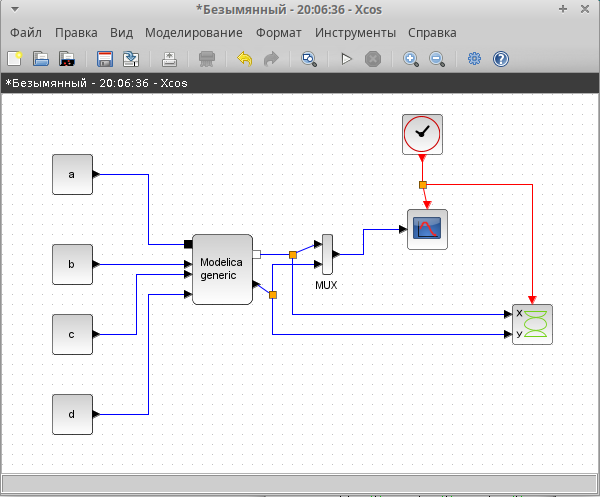
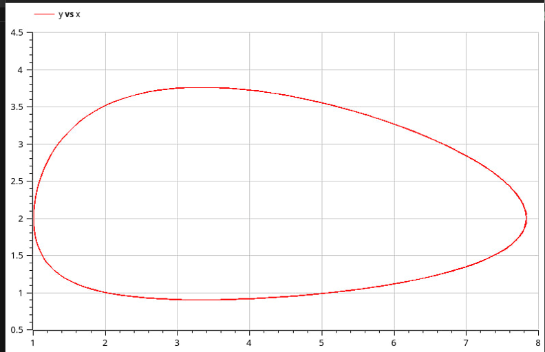

---
## Front matter
title: "Презентация по лабораторной работе № 6"
subtitle: "Модель «хищник–жертва"
author: " Нзита Диатезилуа Катенди"

## Generic otions
lang: ru-RU

## Formatting
toc: false
slide_level: 2
theme: metropolis
header-includes:
- \metroset{progressbar=frametitle,sectionpage=progressbar,numbering=fraction}
- '\makeatletter'
- '\beamer@ignorenonframefalse'
- '\makeatother'
aspectratio: 43
section-titles: true
---

# Информация

## Докладчик

:::::::::::::: {.columns align=center}
::: {.column width="70%"}

  * Нзита Диатезилуа Катенди
  * студент группы НКНбд-01-21
  * Российский университет дружбы народов
  * <https://github.com/NzitaKatendi/Modeling-of-information-processes>

:::
::: {.column width="30%"}

:::
::::::::::::::

# Цели и задачи работы

## Цель лабораторной работы

Целью данной работы является построение модели «хищник-жертва».
 
---

# Выполнение лабораторной работы

1. Зафиксируем начальные данные: a = 2, b = 1, c = 0, 3, d = 1, x(0) = 2, y(0) = 1.
В меню Моделирование, Задать переменные окружения зададим значения коэффициентов a, b, c, d

## Задача 1

{ #fig:001 width=70% }

---

{ #fig:002 width=70% }

---

{ #fig:003 width=70% }

---

{ #fig:004 width=70% }

---

{ #fig:005 width=70% }

---

{ #fig:006 width=70% }

Запустив, получим аналогичный график как в пункте 3.
Перейдем к реализации на OpenModelica.

---
##  Задание для самостоятельного выполнения

Упражнение. Реализуйте модель «хищник – жертва» в OpenModelica. Постройте
графики изменения численности популяций и фазовый портрет

1. xcos + modelica

{ #fig:007 width=70% }

---

{ #fig:008 width=70% }

---
2. OpenModelicq

{ #fig:009 width=70% }

---

# Выводы

Мы реализовали модель "Хищник-жертва" в xcos, modelica и OpenModelica.