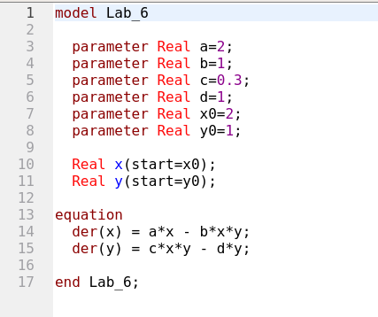

---
# Front matter
lang: ru-RU
title: "Отчет по Лабораторной Работе № 6"
subtitle: "Модель «хищник–жертва"
author: "Нзита Диатезилуа Катенди"

## Pdf output format
toc: true # Table of contents
toc-depth: 2
fontsize: 12pt
linestretch: 1.5
papersize: a4
documentclass: scrreprt
## I18n polyglossia
polyglossia-lang:
  name: russian
  options:
        - spelling=modern
        - babelshorthands=true
polyglossia-otherlangs:
  name: english
## I18n babel
babel-lang: russian
babel-otherlangs: english
## Fonts
mainfont: PT Serif
romanfont: PT Serif
sansfont: PT Sans
monofont: PT Mono
mainfontoptions: Ligatures=TeX
romanfontoptions: Ligatures=TeX
sansfontoptions: Ligatures=TeX,Scale=MatchLowercase
monofontoptions: Scale=MatchLowercase,Scale=0.9
## Biblatex
biblatex: true
biblio-style: "gost-numeric"
biblatexoptions:
  - parentracker=true
  - backend=biber
  - hyperref=auto
  - language=auto
  - autolang=other*
  - citestyle=gost-numeric
## Pandoc-crossref LaTeX customization
figureTitle: "Рис."
tableTitle: "Таблица"
listingTitle: "Листинг"
lofTitle: "Цель Работы"
lotTitle: "Ход Работы"
lolTitle: "Листинги"
## Misc options
indent: true
header-includes:
  - \usepackage{indentfirst}
  - \usepackage{float} # keep figures where there are in the text
  - \floatplacement{figure}{H} # keep figures where there are in the text
---

# Цели и задачи работы

## Цель лабораторной работы

Целью данной работы является построение модели эпидемии.
 
---

# Выполнение лабораторной работы

1. Зафиксируем начальные данные: a = 2, b = 1, c = 0, 3, d = 1, x(0) = 2, y(0) = 1.
В меню Моделирование, Задать переменные окружения зададим значения коэффициентов a, b, c, d

---

## Задача 1

{ #fig:001 width=70% }

---
2. Сделаем блок-схему для моделирования.

{ #fig:002 width=70% }

---

{ #fig:003 width=70% }

---

{ #fig:004 width=70% }

---

{ #fig:005 width=70% }

---

{ #fig:006 width=70% }

---

{ #fig:007 width=70% }

---

{ #fig:008 width=70% }

---

{ #fig:009 width=70% }

---
##  Задание для самостоятельного выполнения

Реализуйте модель «хищник – жертва» в OpenModelica. Постройте графики изменения численности популяций и фазовый портрет.

1. xcos + modelica

{ #fig:010 width=70% }

---

{ #fig:011 width=70% }

---
2. OpenModelica

{ #fig:012 width=70% }

---

# Выводы

Мы реализовали модель "Хищник-жертва" в x cos, modelica и OpenModelica.