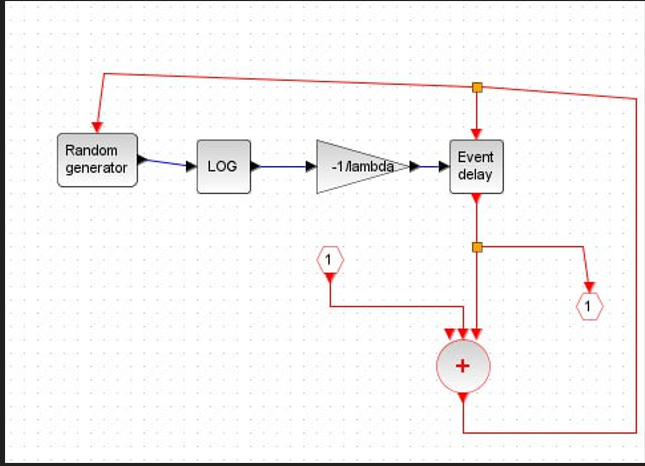
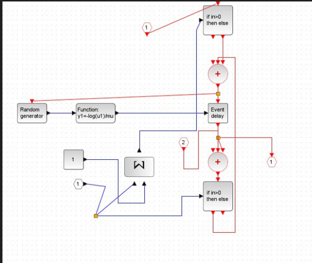
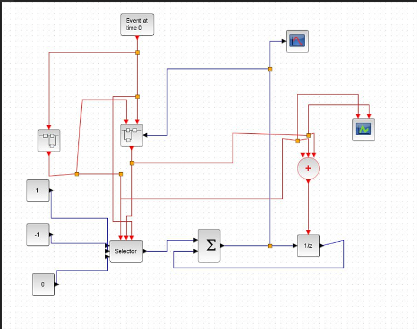
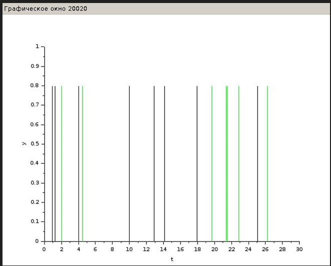
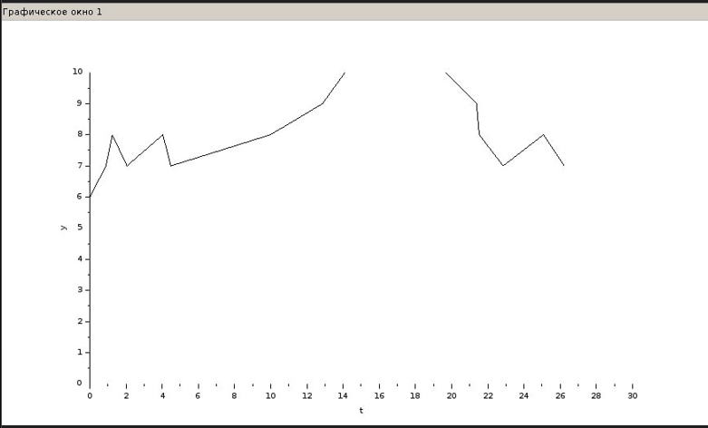

---
## Front matter
title: "Презентация по лабораторной работе № 7"
subtitle: "Модель M|M|1|∞"
author: " Нзита Диатезилуа Катенди"

## Generic otions
lang: ru-RU

## Formatting
toc: false
slide_level: 2
theme: metropolis
header-includes:
- \metroset{progressbar=frametitle,sectionpage=progressbar,numbering=fraction}
- '\makeatletter'
- '\beamer@ignorenonframefalse'
- '\makeatother'
aspectratio: 43
section-titles: true
---

# Информация

## Докладчик

:::::::::::::: {.columns align=center}
::: {.column width="70%"}

  * Нзита Диатезилуа Катенди
  * студент группы НКНбд-01-21
  * Российский университет дружбы народов
  * <https://github.com/NzitaKatendi/Modeling-of-information-processes>

:::
::: {.column width="30%"}

:::
::::::::::::::

# Цели и задачи работы

## Цель лабораторной работы

Целью данной работы является построение модели M|M|1|∞.
 
---

# Выполнение лабораторной работы

Рассмотрим пример моделирования в xcos системы массового обслуживания типа
M|M|1|∞.

Зафиксируем начальные данные: λ = 0, 3, µ = 0, 35, z0 = 6. Суперблок, моделирующий поступление заявок, представлен на рис. 1

## Задача 1

{ #fig:001 width=70% }

---
Суперблок, моделирующий процесс обработки заявок, представлен на рис. 2

{ #fig:002 width=70% }

---

Готовая модель M|M|1|∞ представлена на риc. 3

{ #fig:003 width=70% }

---

Результат моделирования представлен на рис. 4 и 5

{ #fig:004 width=70% }

---

{ #fig:005 width=70% }

---

# Выводы

Реализуем построение модели M|M|1|∞ в xcos.