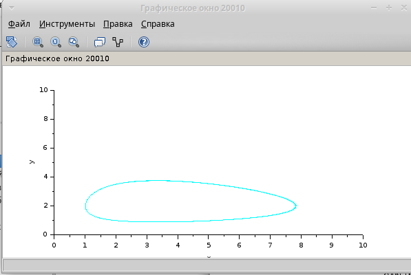

---
# Front matter
lang: ru-RU
title: "Отчет по Лабораторной Работе № 8"
subtitle: "Модель TCP/AQM"
author: "Нзита Диатезилуа Катенди"

## Pdf output format
toc: true # Table of contents
toc-depth: 2
fontsize: 12pt
linestretch: 1.5
papersize: a4
documentclass: scrreprt
## I18n polyglossia
polyglossia-lang:
  name: russian
  options:
        - spelling=modern
        - babelshorthands=true
polyglossia-otherlangs:
  name: english
## I18n babel
babel-lang: russian
babel-otherlangs: english
## Fonts
mainfont: PT Serif
romanfont: PT Serif
sansfont: PT Sans
monofont: PT Mono
mainfontoptions: Ligatures=TeX
romanfontoptions: Ligatures=TeX
sansfontoptions: Ligatures=TeX,Scale=MatchLowercase
monofontoptions: Scale=MatchLowercase,Scale=0.9
## Biblatex
biblatex: true
biblio-style: "gost-numeric"
biblatexoptions:
  - parentracker=true
  - backend=biber
  - hyperref=auto
  - language=auto
  - autolang=other*
  - citestyle=gost-numeric
## Pandoc-crossref LaTeX customization
figureTitle: "Рис."
tableTitle: "Таблица"
listingTitle: "Листинг"
lofTitle: "Цель Работы"
lotTitle: "Ход Работы"
lolTitle: "Листинги"
## Misc options
indent: true
header-includes:
  - \usepackage{indentfirst}
  - \usepackage{float} # keep figures where there are in the text
  - \floatplacement{figure}{H} # keep figures where there are in the text
---

# Цели и задачи работы

## Цель лабораторной работы

Целью данной работы является построение Модель TCP/AQM.
 
---

# Выполнение лабораторной работы

Схема xcos, моделирующая систему (8.4)–(8.5), с начальными значениями параметров N = 1, R = 1,
 K = 5, 3, C = 1, W(0) = 0, 1, Q(0) = 1 приведена на рис. 1
рис. 8.1

## Задача 1

{ #fig:001 width=70% }

---
Результат моделирования представлен на рис. 2 и 3.

На рис. 2 представлена динамика изменения размера TCP окна W(t) (сплошная
линия) и размера очереди Q(t) (пунктирная линия).

{ #fig:002 width=70% }

---

На рис. 3 представлен фазовый портрет (W, Q), который показывает наличие
автоколебаний параметров системы — фазовая траектория осциллирует вокруг своей
стационарной точки

{ #fig:003 width=70% }

---

При C = 0, 9 автоколебания более выраженные (рис. 8.4 и 8.5).

{ #fig:004 width=70% }

---

{ #fig:005 width=70% }

---

# Задание для самостоятельного выполнения

Реализуйте модель (8.4)–(8.5) с использованием языка Modelica в среде OpenModelica.
 Для реализации задержки используйте оператор delay(). Постройте график динамики изменения размера TCP окна W(t) 
 и размера очереди Q(t) и фазовый портрет (W, Q) Результат моделирования представлен на рис. 4 и 5

 --

 { #fig:006 width=70% }

---

{ #fig:007 width=70% }

---

{ #fig:008 width=70% }

---

# Выводы

Мы успешно изучили теорию и реализовали модель TCP/AQM в Xcos и с помощью OpenModelica.